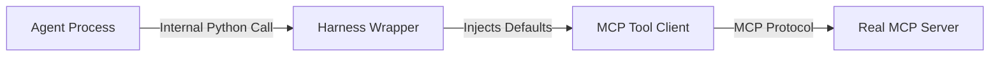
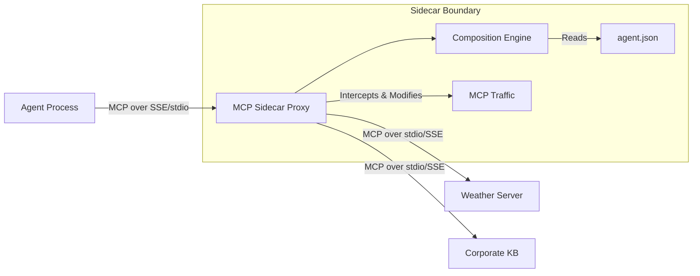

# Phase 2a: Python-based MCP Sidecar Proxy PoC

## Overview

This document outlines the plan for **Phase 2a** of the Agent Playground architecture: transitioning from the embedded "Tool Wrapper" logic (Phase 1) to a standalone, process-isolated **MCP Sidecar Proxy**.

We will base this Proof of Concept (PoC) on a fork of [sparfenyuk/mcp-proxy](https://github.com/sparfenyuk/mcp-proxy), a Python-based bridge between stdio and SSE/HTTP MCP transports. This Python implementation serves as a rapid prototyping ground for the eventual high-performance Sidecar (likely in Go/Rust).

## The Core Design Flaw: Context Pollution & Abstraction Leaks

Current MCP client integration (in frameworks like LangGraph/LangChain) naïvely dumps the raw tool definitions from the MCP Server directly into the LLM's context window. This creates several critical issues (see `docs/tool-composition-exploration.md` for full analysis):

1.  **Context Bloat**: Tools often expose complex implementation details (e.g., `station_id`, `api_key`, `debug_flags`) that help developers but confuse LLMs.
2.  **Namespace Pollution**: Different tools might conflict on common terms like `user_id` or `query`.
3.  **Abstraction Mismatches**: A server might expose a low-level `fetch_raw_bytes` when the agent builder only wants to expose `get_summary`.
4.  **No Deterministic Simplification**: The Agent builder cannot "curate" the toolset; they must accept whatever the Server owner provides.

**The Goal**: To solve the "N×M Problem" of Tool Composition.
*   **N** Agent Builders want to reuse tools.
*   **M** Service Owners publish tools.
*   **The Gap**: The Agent Builder needs a *semantic adapter layer* to reshape the M tools to fit their specific N agent contexts without writing custom Python wrapper code for every single tool.

## Core Objectives

1.  **Process Isolation**: Move the tool override and schema simplification logic *out* of the Agent's process and *into* a separate Proxy process.
2.  **Protocol Purity**: The Agent should speak standard MCP to `localhost:proxy_port`. It should *not* know about "overrides" or "simplifications"—it just sees a clean list of tools.
3.  **Centralized Composition**: The Proxy becomes the "Composer" that reads the `agent.json` overrides and projects a curated view of the world to the LLM.
    *   **Reshaping**: Renaming tools, hiding fields, and injecting deterministic defaults (e.g. `zipcode=90210` or `user_id=uuid()`).
    *   **Taint Tracking (Future)**: Monitoring data flow between "Sensitive" and "Open World" tools.

## Architecture

### Current State (Phase 1)


### Target State (Phase 2a)


## Implementation Plan

### 1. Setup & Fork
*   **Base Repo**: Fork `sparfenyuk/mcp-proxy`.
*   **Location**: Clone into `services/mcp-sidecar`.
*   **Environment**: Ensure it runs with `uv` or standard `pip` in the current monorepo structure.

### 2. Extend Configuration
The standard `mcp-proxy` config maps names to commands. We need to extend this to support our `ToolOverride` schema.

**New Config Schema (`sidecar_config.json`):**
```json
{
  "mcpServers": {
    "weather": {
      "command": "uvx",
      "args": ["mcp-server-weather"],
      "env": {"API_KEY": "secret"} 
    }
  },
  "overrides": {
    "weather:fetch_forecast": {
      "rename": "get_weather",
      "description": "Get the weather for a city",
      "hide_fields": ["station_id", "debug_mode"],
      "defaults": {
        "station_id": "12345",
        "units": "metric"
      }
    }
  }
}
```

### 3. Implement Interceptor Logic
We need to hook into the `mcp-proxy` message handling loop.

*   **`tools/list` Interceptor**:
    *   Intercept the response from the upstream server.
    *   Apply `rename` and `description` overrides.
    *   **Crucial**: Dynamically rewrite the `inputSchema` (JSON Schema) to remove `hide_fields` and fields that have `defaults`.
    *   Return the *simplified* list to the Agent.

*   **`tools/call` Interceptor**:
    *   Intercept the request from the Agent.
    *   Match the (potentially renamed) tool name back to the original upstream ID.
    *   **Injection**: Merge the `defaults` into the `arguments` payload.
    *   Forward the modified request to the upstream server.

### 4. "Linear Type" State Machine (PoC)
Implement a basic state tracker for the session.

*   **State**: `ContextSecurityLevel: Public | Confidential | Secret`
*   **Logic**:
    *   Tag specific tools in config as `classification: Confidential`.
    *   If a `Confidential` tool is called, upgrade the session state.
    *   **Trigger**: Send `notifications/tools/list_changed` to the Agent.
    *   **Reaction**: When Agent calls `tools/list` again, filter out any tools tagged `OpenWorld`.

### 5. Integration Test
Create a test case that:
1.  Spins up the `mcp-sidecar` on a local port.
2.  Configures it with a Mock MCP Server (that requires a hidden argument).
3.  Connects a standard `MultiServerMCPClient` (the Agent) to the Sidecar.
4.  **Asserts**:
    *   The Agent sees the *sanitized* tool signature (hidden argument removed).
    *   The Agent calls the tool *without* the hidden argument.
    *   The Mock Server receives the call *with* the argument (injected by Sidecar).

## Success Criteria
*   The Agent codebase (`agent-factory`) contains **zero** logic for tool overrides or defaults injection.
*   All override logic resides in `services/mcp-sidecar`.
*   The "Overrides" test case passes end-to-end over a real network socket.

## Next Steps
1.  Execute the fork and setup of `sparfenyuk/mcp-proxy`.
2.  Port the `_wrap_tool_with_override` logic from `harness.py` into the Proxy's message handler.
3.  Verify with the `weather_agent` example.

