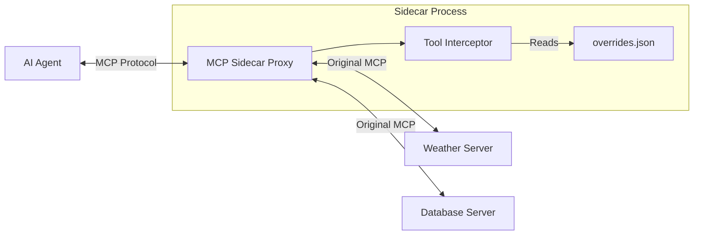

# MCP Sidecar Proxy & Tool Composition


The **MCP Sidecar Proxy** provides the abstraction layer necessary to treat Agent building as "programming in natural language."

If we consider Large Language Models (LLMs) as an Operating System, then the prompt we feed them is the "program." In this paradigm, MCP servers act as software libraries—"peripherals" that extend the OS's capabilities.

However, raw MCP integration is akin to unrolling a library's source code and pasting it directly into your program's `main()` function. It solves the "N×M Problem" of connecting many tools to many clients, but does so with tight coupling: the Agent Builder must accept the Tool Builder's exact implementation, variable names, and complexity.

The Sidecar Proxy acts as a composition layer that allows Agent Builders to wrap these raw "libraries" in controlled functions. It lets you define the interface your "program" (the Agent) interacts with, reshaping standard tools to fit your specific context without requiring changes from the underlying Service Owner.


## Core Capabilities

The Sidecar allows you to **override** the behavior of standard MCP tools via configuration, without writing code.

1.  **Rename Tools**: Change `fetch_forecast` to `get_weather` to match your agent's vocabulary.
2.  **Inject Defaults**: Pre-fill arguments like `api_key`, `user_id`, or `units` so the LLM doesn't see them or hallucinate them.
3.  **Hide Fields**: Remove specific fields from the JSON Schema exposed to the LLM. This reduces context bloat and prevents the LLM from trying to set internal parameters.
4.  **Simplify Descriptions**: Rewrite tool descriptions to be more prompt-friendly.

## Architecture



1.  **`list_tools` Interception**: When the Agent asks for tools, the Sidecar fetches the real list from the upstream server, applies your renames and schema simplifications, and returns the "curated" list to the Agent.
2.  **`call_tool` Interception**: When the Agent calls a modified tool (e.g., `get_weather`), the Sidecar intercepts the call, maps it back to the original name (`fetch_forecast`), injects any hidden default values, and forwards the request to the real server.

## Configuration

You define overrides in the `overrides` section of your MCP Proxy configuration file (e.g., `server_config.json`).

### Schema

```json
{
  "mcpServers": {
    // Standard MCP Server definitions...
  },
  "overrides": {
    "ORIGINAL_TOOL_NAME": {
      "rename": "NEW_TOOL_NAME",
      "description": "NEW_DESCRIPTION",
      "defaults": {
        "ARGUMENT_NAME": "VALUE"
      },
      "hide_fields": [
        "ARGUMENT_NAME_1",
        "ARGUMENT_NAME_2"
      ],
      "output_schema": {
        "type": "object",
        "properties": {
          "PUBLIC_FIELD": { "type": "string" }
        }
      }
    }
  }
}
```

### Example

Suppose you have a weather server that exposes this complex tool:

**Original Tool:** `fetch_forecast`
```json
{
  "name": "fetch_forecast",
  "description": "Raw weather data fetcher v2",
  "inputSchema": {
    "type": "object",
    "properties": {
      "city": {"type": "string"},
      "station_id": {"type": "string"},
      "api_key": {"type": "string"},
      "debug_mode": {"type": "boolean"}
    },
    "required": ["city", "station_id", "api_key"]
  },
  "outputSchema": {
    "type": "object",
    "properties": {
      "temperature": {"type": "number"},
      "conditions": {"type": "string"},
      "internal_station_code": {"type": "string"},
      "raw_sensor_dump": {"type": "string"}
    }
  }
}
```

You want your Agent to see a simple `get_weather(city)` tool that only returns temperature and conditions.

**Configuration:**
```json
{
  "mcpServers": {
    "weather": {
      "command": "uvx",
      "args": ["mcp-server-weather"]
    }
  },
  "overrides": {
    "fetch_forecast": {
      "rename": "get_weather",
      "description": "Get the current weather for a specific city.",
      "defaults": {
        "api_key": "${env.WEATHER_API_KEY}", 
        "station_id": "KPAL",
        "debug_mode": false
      },
      "hide_fields": ["api_key", "station_id", "debug_mode"],
      "output_schema": {
        "type": "object",
        "properties": {
          "temperature": {"type": "number"},
          "conditions": {"type": "string"}
        }
      }
    }
  }
}
```

**What the Agent Sees:**
```json
{
  "name": "get_weather",
  "description": "Get the current weather for a specific city.",
  "inputSchema": {
    "type": "object",
    "properties": {
      "city": {"type": "string"}
    },
    "required": ["city"]
  },
  "outputSchema": {
    "type": "object",
    "properties": {
      "temperature": {"type": "number"},
      "conditions": {"type": "string"}
    }
  }
}
```

When the tool is executed, the Sidecar will filter the structured result to remove `internal_station_code` and `raw_sensor_dump`, returning only the fields specified in `output_schema`.

## Usage

Run the proxy pointing to your config file:

```bash
# Ensure your config file has both mcpServers and overrides
mcp-proxy --named-server-config ./my-agent-config.json
```

The proxy will expose an SSE endpoint (e.g., `http://127.0.0.1:8080/sse`) that serves the *composed* view of your tools. Connect your agent (Claude Desktop, LangChain, etc.) to this endpoint.

## Best Practices

*   **Security**: Use `defaults` to inject sensitive API keys inside the proxy so they never traverse the wire to the LLM or sit in the Agent's context window.
*   **Focus**: Hide "power user" flags that might confuse the model.
*   **Consistency**: Rename tools from different vendors to follow a consistent naming convention (e.g., `search_google`, `search_github` -> `web_search`, `code_search`).

